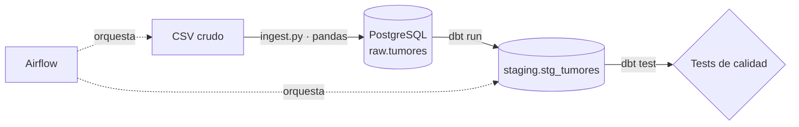

# Tumor Pipeline

Pipeline de ingeniería de datos (ELT) sobre un CSV hospitalario de 250.000 registros de tumores cerebrales. Carga el dato crudo en PostgreSQL, lo limpia y valida con dbt, y orquesta todo con Airflow sobre Docker. El resultado son datos limpios y con tipos correctos, listos para entrenar un modelo de clasificación benigno/maligno (el entrenamiento queda fuera del alcance de este proyecto).

## Arquitectura



## Stack

Python (pandas, SQLAlchemy) · PostgreSQL 16 · dbt (dbt-core + dbt-postgres) · Apache Airflow 3 · Docker / Docker Compose · Git/GitHub

## Decisiones de diseño

- **ELT en lugar de ETL:** el dato se carga tal cual llega (todo como texto) en el esquema `raw`, y las transformaciones se hacen dentro del almacén con SQL versionado en dbt.
- **Capa `raw` inmutable:** si la limpieza cambia, se reconstruye `staging` sin volver a leer el CSV.
- **Ingesta idempotente:** cada ejecución vacía `raw.tumores` y vuelve a cargarla en una sola transacción, así que repetir el pipeline no duplica filas.
- **Sin Spark ni Kafka:** 250.000 filas caben de sobra en PostgreSQL; esas herramientas añadirían complejidad sin beneficio.
- **dbt para la calidad de datos:** los tests viven junto a los modelos y se ejecutan en cada pasada del pipeline.

## Estructura

```
├── airflow/
│   ├── Dockerfile          # Airflow + entorno con dbt y pandas
│   └── dags/tumor_pipeline.py
├── dbt_project/
│   ├── models/staging/     # stg_tumores + schema.yml (tests)
│   ├── macros/yes_no.sql
│   └── tests/              # tests personalizados
├── ingest/ingest.py        # carga del CSV en raw.tumores
├── docker-compose.yml
└── .env.example
```

## Cómo ejecutarlo

1. Clona el repositorio y copia `.env.example` a `.env` con tus credenciales.
2. Descarga el dataset (https://www.kaggle.com/datasets/ankushpanday1/brain-tumor-prediction-dataset) y guárdalo como `data/raw/tumores.csv`.
3. Levanta los servicios:
```
   docker compose up -d --build
```
4. Obtén la contraseña de Airflow y entra en http://localhost:8080 (usuario `admin`):
```
   docker compose logs airflow | grep "Password for user"
```
   (En PowerShell: `docker compose logs airflow | Select-String "Password for user"`.)
5. Lanza el DAG `tumor_pipeline`. Ejecuta `ingest → dbt_run → dbt_test`.

## Transformaciones (staging)

- Nombres de columnas a `snake_case` y tipos correctos (enteros, numéricos, booleanos).
- Strings vacíos convertidos a `NULL`; texto normalizado en minúsculas.
- `Blood_Pressure` (`122/88`) separado en `systolic_bp` y `diastolic_bp`.
- Columnas Yes/No convertidas a booleano con una macro reutilizable.

## Calidad de datos

Tests de dbt sobre `stg_tumores`: unicidad y no nulos de la clave, valores aceptados de `gender` y `tumor_type`, y rango de edad (0–120). Todos pasan.

Hallazgos que se documentan y no se corrigen (tests con severidad `warn`):

| Hallazgo | Filas | % del total |
|---|---|---|
| Presión diastólica ≥ sistólica | 22.335 | ≈ 9 % |
| Tumor maligno con `Brain_Tumor_Present = No` | 62.698 | ≈ 25 % |

La segunda incoherencia sugiere que `Tumor_Type` y `Brain_Tumor_Present` no miden lo mismo, así que `tumor_type` se toma como variable objetivo.

## Posibles mejoras

- Entrenar y evaluar un modelo de clasificación sobre `stg_tumores`.
- Capa `marts` con agregados para analítica.
- Ejecución programada (`schedule`) y alertas ante fallos.